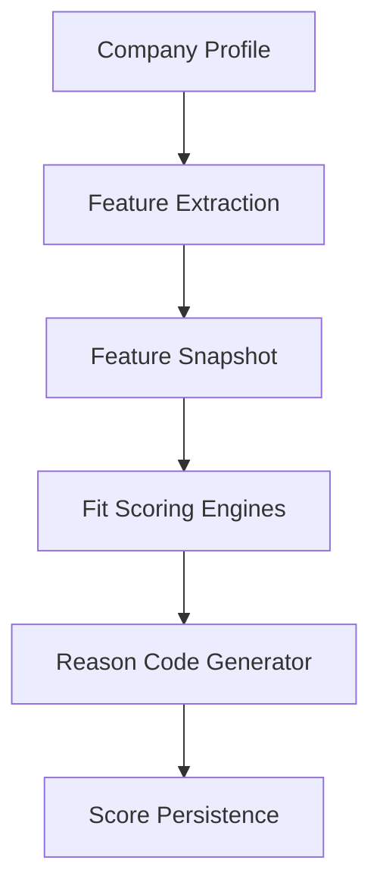

# DEPRECATED

This document is superseded by JOEP v2.

Do not use this document for new scoring-engine implementation.

Authoritative sources:
- JOEP-INFONICS-v2.0-UNIFIED-IMPLEMENTATION.md
- JOEP-v2-GATES-ICP-ROUTING.md
- JOEP-v2-IMPLEMENTATION-PLAN.md

---

# Phase 4A Architecture

The Opportunity Scoring Engine introduces a strict separation between raw operational data and scoring logic via the Feature Extraction layer.

