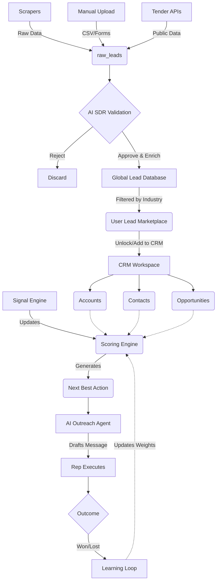
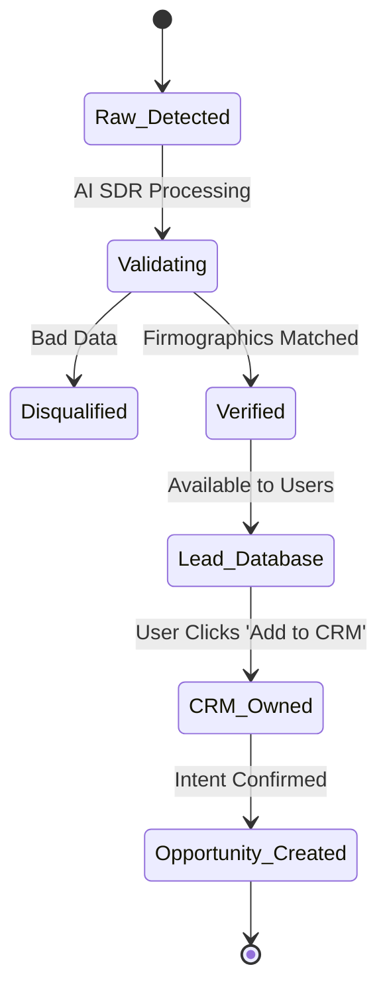
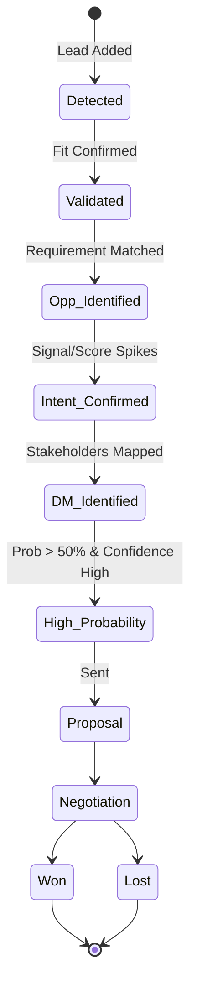
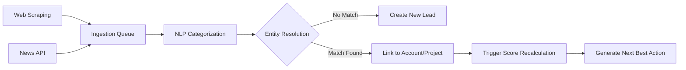
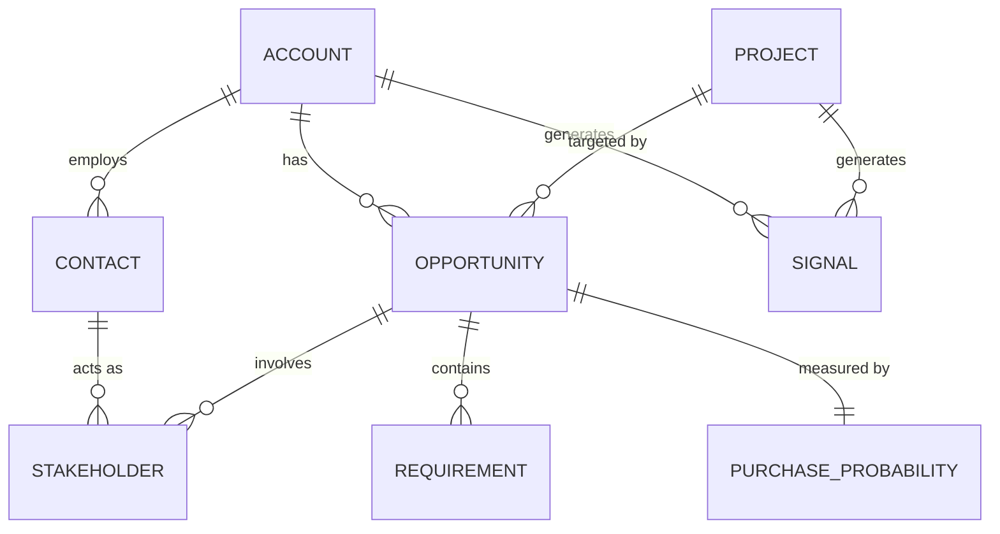
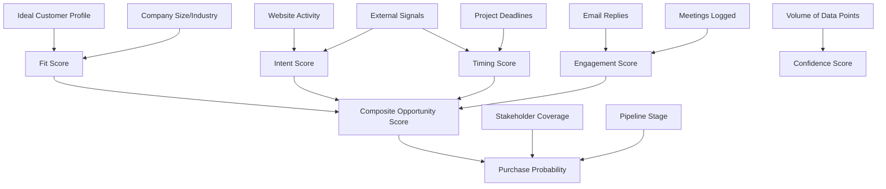
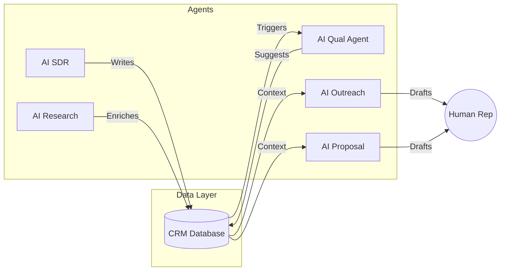
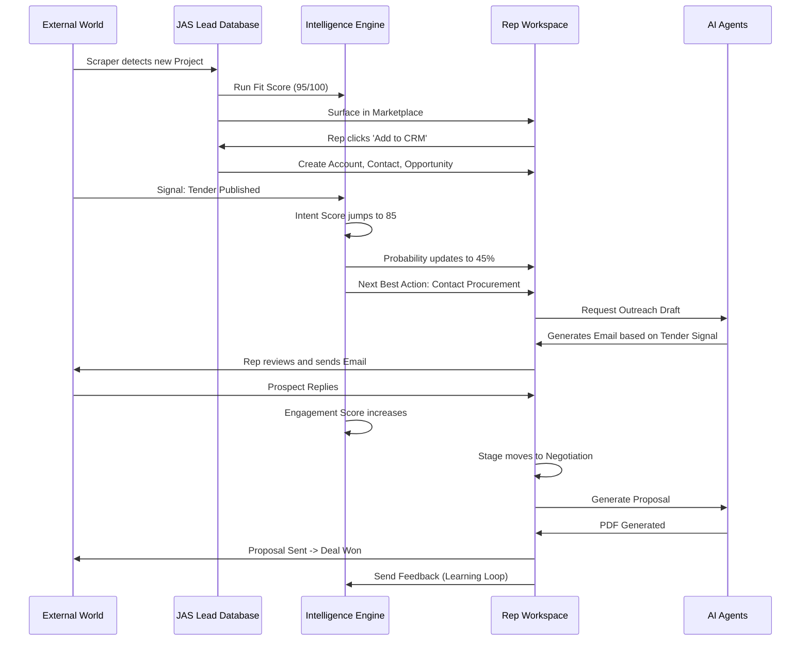

# JAS CONNECT CRM 2.0 - Complete Operational Workflow

This document details the complete end-to-end operational workflow of JAS CONNECT CRM, defining exactly how data enters, evolves, and drives action through the Opportunity Intelligence Operating System.

---

## PART 1 – LEAD ORIGIN FLOW

**Origin Points:**
Leads enter the ecosystem via multiple channels:
- **Scraping/Data Partners:** Google Maps, Outscraper, Apollo, ZoomInfo, IndiaMART, TradeIndia.
- **Public & Government:** Tenders, Government Sources.
- **Manual Input:** Manual Upload, CSV Upload, Excel Upload, User Submitted Leads.
- **Autonomous Discovery:** AI Discovered Leads (AI Research Agent browsing industry directories).

**Entry & Reception:**
- **Table:** `raw_leads` (Staging Environment).
- **Module:** Lead Ingestion & Enrichment Engine.

**Deduplication & Handling:**
- The engine uses a deterministic hash matching algorithm checking `Domain (Website)`, `Email Address`, and `Phone Number`. 
- If a match exists, the new payload is merged (enriching empty fields) rather than creating duplicates. 
- A `lead_versions` record is created to track history.

**Enrichment & Industry Assignment:**
- **Enrichment:** Triggered immediately. Webhooks query clearbit/apollo equivalents to pull firmographics (employee count, revenue, exact location).
- **Industry Assignment:** The NLP Categorization engine analyzes the lead's description, scraped website text, and SIC/NAICS codes to map it to a JAS CONNECT Vertical (e.g., Construction, PEB, EPC).

**Scoring Initialization:**
- **Fit Score** is the first score to calculate. Since it relies purely on static firmographic data (Industry, Size, Location vs ICP), it initializes immediately upon successful enrichment.

---

## PART 2 – RAW DATABASE FLOW

**What Data Lives Here:**
- Unvalidated, messy data containing raw JSON payloads from scrapers, unstructured text, incomplete contact information, and initial metadata.

**Duration:**
- Leads stay in the raw database temporarily (minutes to hours). They remain here until the **AI SDR Agent** or automated validation pipeline processes them, cleans the data, formats phone numbers, and verifies emails.

**Categorization & Mapping:**
- Leads are categorized by **Source Type** and **Ingestion Batch**.
- The schema is mapped from disparate vendor formats (e.g., ZoomInfo's schema vs IndiaMART's XML) into the unified JAS CONNECT `leads` table schema.

**Versioning:**
- The original raw payload is permanently stored in a `payload_history` JSONB column. Any normalizations (fixing typos, title casing names) are applied to the active columns.

---

## PART 3 – CLIENT LEAD DATABASE FLOW

**How Raw Leads Become Visible:**
- Once a lead is validated (emails verified, industry mapped), its `verification_status` shifts to `'verified'`. It is then promoted to the global `leads` table (The Lead Database / Marketplace).

**Filtering & Visibility:**
- **Applied Filters:** When a user opens the Lead Database, the system automatically applies a filter: `industry_id = user.industry_id`.
- **Hidden Data:** For Free/Basic users, PII (Personally Identifiable Information) such as exact Emails, Phone Numbers, and LinkedIn URLs are hidden/obfuscated.
- **Shown Data:** Company Name, Location, Budget, Requirements, Industry, Project Type.

**Premium vs. Free:**
- **Premium/Elite Users:** Have immediate access to view contact details (up to their quota).
- **Free/Basic Users:** Must spend a credit or pay a fee (₹99) to "Unlock" the lead, which adds the lead ID to their `lead_unlocks` table and reveals the data.

---

## PART 4 – OPPORTUNITY INTELLIGENCE FLOW

Once a user interacts with a lead or saves it, the intelligence engine fully activates.

| Score | When it Runs | Inputs | Formula | Storage & Update Frequency |
|---|---|---|---|---|
| **Fit Score** | On creation/enrichment | Industry, size, location, project type vs. User's ICP. | Weighted sum of matched attributes (e.g., +20 for exact industry match). | `lead_scores`. Updates rarely (only on firmographic changes). |
| **Intent Score** | On signal detection | Web visits, tender downloads, inbound queries. | Recency weight × Signal severity (Decay function applies). | `lead_scores`. Updates real-time on signal + nightly decay. |
| **Timing Score** | On project milestones | Project deadlines, tender closing dates, fiscal year ends. | Inverse distance to key date (closer = higher score). | `lead_scores`. Updates daily via batch. |
| **Engagement Score** | On outreach interaction | Email opens, replies, call duration, meeting attendance. | Volume × Recency × Sentiment factor. | `lead_scores` & `opportunities`. Updates real-time on interaction. |

---

## PART 5 – CRM ENTRY FLOW

**User clicks: "Add To CRM"**

**What Happens:**
The lead is duplicated/linked from the global public pool into the user's private workspace.

**Records Created / Updated:**
1. **`accounts`**: If the company doesn't exist in the user's CRM, a new Account record is generated.
2. **`contacts`**: Associated people from the lead are converted into Contact records attached to the Account.
3. **`crm_leads`**: A record is created indicating ownership (`assigned_to = user.id`), with `source_type = 'lead_database'`.
4. **`lead_unlocks`**: (If not already unlocked) The system registers the unlock to prevent future billing.

---

## PART 6 – CRM WORKSPACE FLOW

Inside the CRM, the raw "Lead" concept diffuses into distinct relational objects:

- **Account:** The business entity (e.g., "L&T Construction").
- **Contact:** An individual at the Account (e.g., "Rahul Sharma").
- **Stakeholder:** A Contact explicitly linked to a specific Opportunity, tagged with a role (e.g., "Technical Buyer").
- **Project:** The physical entity or tender (e.g., "Pune Metro Line 3"). Multiple vendors can have opportunities on one Project.
- **Opportunity:** The commercial pursuit to sell your product to the Account for the Project.
- **Requirement:** Specific parameters of the opportunity (e.g., "Needs 500 tons of structural steel").

*Relationships:* An **Account** has many **Contacts** and **Opportunities**. An **Opportunity** links to one **Project**, contains many **Requirements**, and involves multiple **Stakeholders**.

---

## PART 7 – SIGNAL INTELLIGENCE FLOW

**Sources:**
News APIs, LinkedIn Scrapers, Tender Portals, Website Analytics, User CRM actions.

**Storage & Attachment:**
- Signals are stored in the `signals` table.
- The AI Research Agent maps signals to Accounts (via domain matching) or Projects (via keyword/Tender ID matching).

**Updating Scores:**
- When a signal (e.g., "New Funding Detected") attaches to an Account, a webhook fires.
- The scoring engine recalculates the **Intent Score** (spikes due to funding) and **Timing Score** (spikes due to capital availability).
- Any open Opportunities linked to that Account immediately see their **Opportunity Score** increase.

---

## PART 8 – PURCHASE PROBABILITY FLOW

**When it starts:**
Initializes the moment an **Opportunity** is created from a qualified lead.

**When it updates:**
- **Stage Progression:** Moving from "Intent Confirmed" to "Decision Maker Identified".
- **Signals:** Negative signals (e.g., "Budget Frozen") drop probability; positive signals increase it.
- **Time Decay:** If an opportunity sits in "Negotiation" with 0 engagement for 30 days, probability automatically erodes.

**Confidence Score:**
- A secondary metric measuring *data density*. 
- If Probability is 80% but relies solely on a single web visit and a high Fit Score, Confidence is LOW (e.g., 20%). 
- As Stakeholders are mapped, emails are replied to, and meetings are logged, Confidence rises to 90%+, telling the rep the 80% Probability is real.

---

## PART 9 – DECISION INTELLIGENCE FLOW

The **Next Best Action (NBA)** engine processes the Opportunity state to tell the rep exactly what to do today.

- **Recommended Contact:** Looks at the Stakeholder Map. If the Decision Maker has 0 engagement, they become the recommended contact. If the Champion just opened an email, they become the recommended contact.
- **Recommended Product:** Evaluates the `Requirement` object text using NLP to map against the user's product catalog.
- **Recommended Timing:** Analyzes historical email open times for the Account. (e.g., "Send on Tuesday at 10 AM").
- **Generation:** Synthesized nightly and displayed at the top of the Opportunity Dashboard as actionable tasks.

---

## PART 10 – STAKEHOLDER FLOW

- **Discovery:** AI Research Agents scrape LinkedIn/ZoomInfo to find employees matching the Account.
- **Classification:** NLP maps job titles to Roles (e.g., "Chief Financial Officer" -> Financial Buyer).
- **Champions:** Identified when Engagement Score is high and Meeting Sentiment (from logged notes) is positive.
- **Blockers:** Identified via explicit rep tagging or negative email sentiment analysis.
- **Impact on Probability:** The scoring engine applies a hard penalty (e.g., max probability capped at 40%) if no "Decision Maker" or "Financial Buyer" is mapped to an Opportunity in late stages.

---

## PART 11 – OUTREACH FLOW

**User Clicks: "Generate Outreach"**

- **Data Used:** Account Industry (Playbook selection), Active Signals (Icebreaker generation), Stakeholder Role (Value proposition selection).
- **Score Influence:** High Intent = Direct Meeting Request CTA. Low Intent/High Fit = Educational Content CTA.
- **Channel Routing:**
  - **Email:** Used for cold outreach, formal proposals, and initial executive summaries.
  - **WhatsApp:** Suggested only if the Contact's Engagement Score is high (warm relationship) and the message is logistical (e.g., "Checking in on the site visit").
- **Proposals:** The AI Proposal Agent merges Opportunity `Requirements`, Account details, and Product pricing into a standardized PDF/Doc template.

---

## PART 12 – AI AGENT FLOW (ELITE TIER)

| Agent | Trigger | Input | Output | Frequency | Permissions |
|---|---|---|---|---|---|
| **AI SDR** | New Raw Lead | Raw Scraped Data | Enriched Lead, Fit Score | Real-time | Auto-executes |
| **AI Qual Agent** | Intent Score > 70 | Lead Activity | Suggested Opportunity | Real-time | Requires Rep Approval to convert |
| **AI Research** | New Account created | Account Domain | Mapped Signals, Contacts | Nightly | Auto-executes |
| **AI Outreach** | NBA Task generated | Playbook, Context | Draft Email/WhatsApp | On Task Create | Draft only (Rep sends) |
| **AI Follow Up** | 3 days no reply | Email Thread | Draft Follow-up | Scheduled | Draft only (Rep sends) |
| **AI Proposal** | Stage = Proposal | Requirements, Pricing | PDF Draft Document | User Initiated | Draft only |

---

## PART 13 – LEARNING LOOP

**Closing the Loop:**
When an Opportunity is marked **Won** or **Lost**:
1. The outcome and its preceding snapshot of scores/signals are sent to the **Scoring Engine Training DB**.
2. **Score Improvement:** If 100 deals with the signal "Environmental Clearance Approved" are Won 80% of the time, the Engine increases the Intent Weight of that signal globally.
3. **Recommendation Improvement:** If the NBA suggests "Call the CFO" and the rep consistently ignores it, or if it results in Lost deals, the engine lowers the prioritization weight of that specific NBA for that industry.

---

## PART 14 – COMPLETE END-TO-END EXAMPLE

**Scenario: Real Estate Developer Lead (Construction Industry)**

1. **Raw Upload:** A data provider scrapes a news article: "Lodha Group announces new 50-acre township in Pune." Data hits `raw_leads`.
2. **Lead Database:** AI SDR extracts "Lodha Group", validates the domain, and promotes it to the global Lead Database.
3. **Scoring:** Fit Score hits 95 (Perfect ICP for an EPC user).
4. **CRM Entry:** An EPC Sales Rep sees it in the database and clicks "Add To CRM". Account, Contact, and Opportunity are created.
5. **Signals:** Two weeks later, AI Research Agent detects a Tender published for "Pune Township Phase 1 Excavation".
6. **Probability:** Intent Score spikes from 20 to 85. Purchase Probability jumps from 10% to 45%.
7. **Decision Intelligence:** NBA Engine flags the Opportunity: "Tender Published. Coverage Gap: No Technical Buyer identified."
8. **Outreach:** Rep uses AI Research to find the Chief Engineer, clicks "Generate Outreach". AI drafts an email referencing the specific Phase 1 Tender.
9. **Meeting:** Engineer replies. Engagement Score jumps. Meeting is logged. Probability rises to 70%.
10. **Proposal:** Rep clicks "Generate Proposal". AI Proposal Agent pulls the excavation requirements and drafts the document. Stage moves to Proposal.
11. **Won:** Contract signed. System records the win, increasing the future predictive weight of "Excavation Tender" signals.

---
---

## FINAL DELIVERABLES: DIAGRAMS & MAPS

### 1. Complete CRM Data Flow Diagram

### 2. Lead Lifecycle Diagram

### 3. Opportunity Lifecycle Diagram

### 4. Signal Lifecycle Diagram

### 5. CRM Object Relationship Map

### 6. Score Dependency Map

### 7. AI Agent Interaction Map

### 8. End-to-End Execution Flow

